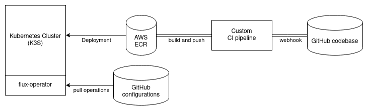

# On-premises Kubernetes Server Setup

> NOTE: This setup will only run on Linux.
> You will also need to install curl before you can continue with the k3s installation.

> NOTE: This documentation was created with the current information from the internet, and thus will not be the best reference. 
Please check the [latest documentation for installing `k3s` and `docker`](https://rancher.com/docs/k3s/latest/en/advanced/).

## Installing docker

The current setup at Spintly uses `docker` for containerization. 
By default however, `k3s` uses containerd, which means an extra step must be performed. 
We need to install `docker`.

```bash
curl https://releases.rancher.com/install-docker/19.03.sh | sh
```

Also, if you wish to run docker commands without using sudo, 
you can add the current user to the `docker` group, by running the following command:

```bash
# REMEMBER, you will need to replace <user> with a user on the system
sudo usermod -aG docker <user>
```

> NOTE: You have to logout/reboot if you want the command to take effect.

## Installing k3s

> NOTE: SCRAPPING k3s in favor of the more powerful and favorable `kubeadm`. This on-premises server runs on a 32GB Intel Xeon, can handle `kubeadm` much better than k3s. k3s is too lightweight. If `kubeadm` fails, then `kind` will be the last alternative.

https://itnext.io/bare-metal-kubernetes-with-kubeadm-nginx-ingress-controller-and-haproxy-bb0a7ef29d4e

https://kubernetes.io/docs/setup/production-environment/tools/kubeadm/install-kubeadm/

https://kubernetes.io/docs/tasks/administer-cluster/kubeadm/configure-cgroup-driver/

https://kubernetes.io/docs/setup/production-environment/tools/kubeadm/create-cluster-kubeadm/

https://stackoverflow.com/questions/48119650/helm-x509-certificate-signed-by-unknown-authority

https://discuss.kubernetes.io/t/the-connection-to-the-server-localhost-8080-was-refused-did-you-specify-the-right-host-or-port/1464/4

https://helm.sh/docs/topics/registries/

Installing k3s is as simple as running a single command, shown below:

```bash
curl -sfL https://get.k3s.io | sh -s - --docker    # and, that's it 
```

After the installation, k3s will start as a systemd service which you can control using the `systemctl` commands.

You can also uninstall the service, by running the following script:

```bash
bash /usr/local/bin/k3s-uninstall.sh
```

An important thing to remember is that the k3s installation script also installs a custom build of the `kubectl` command. 
This version of `kubectl` only allows you to connect to the k3s cluster. 
You can check the version of the kubectl installed by running the following:

``` bash
k3s kubectl version
```

To confirm that the cluster is available, you can run the command:

```bash
sudo k3s kubectl get pods --all-namespaces
```

To confirm that the clusters are running in docker containers, you can run the command:

```bash
sudo docker ps
```

## Installing aws cli

Refer to [this documentation from AWS](https://docs.aws.amazon.com/cli/latest/userguide/getting-started-install.html) for installing AWS cli on Linux.

## Installing Helm

[Helm](https://helm.sh) is the perfect tool for creating kubernetes packages. A kubernetes package is an entire collection of deployment configurations, allowing us to install and manage kubernetes deployments by running simple commands.

Refer to [this documentation from Helm](https://helm.sh/docs/intro/install/#from-script) for installing Helm on Linux.

Using helm on k3s also requires the installation of the helm-controller.

```bash
helm repo add stable https://charts.helm.sh/stable
helm repo update

sudo k3s kubectl cluster-info   # to know the cluster server info

sudo kubectl -n kube-system create serviceaccount tiller
sudo kubectl create clusterrolebinding tiller --clusterrole cluster-admin --serviceaccount=kube-system:tiller
sudo helm init --service-account tiller
```

## Installing Golang

A majority of the tools used to interact with Kubernetes (including Kubernetes itself) is written in Go. We need to install golang on-premises since some utilities need Go's module management during installation and building.

Refer to [this documentation from Golang Downloads](https://go.dev/doc/install) for installation instructions on Linux.

## Create an AWS IAM user

Ask someone who has IAM access to create an IAM user. Currently, a user named `on.prem.server.spintly` with `AmazonEC2ContainerRegistryReadOnly` access has already been created for the Spintly on-premises servers. It is recommended to **create a different user for other on-premises servers**.

Also remember to use `aws configure` to login to that user on the system.

## Creating an AWS ECR repository

> NOTE: TO BE documented. (need to add diagrams and make it really illustrative)

## GitOps and Secrets management

GitOps is a form of DevOps where the configurations are maintained in declarative form (**YAML** files for Kubernetes) on **Git**. This allows for version-controlled configurations, which is one of the best form of auditing and transaction management for cloud infrastructure. More about GitOps [can be found here](https://www.gitops.tech/).

GitOps will allow for easier pull-based OTA updates of the on-premises server. The architecture is shown in the diagram here:


Secrets management will require the following:

1. The Kubernetes Operator, [Bitnami sealed secrets](https://github.com/bitnami-labs/sealed-secrets)
1. The client-side push tool, Kubeseal.

### Installing `kubeseal`

Refer to [this documentation from Bitnami Labs](https://github.com/bitnami-labs/sealed-secrets#installation-from-source) to install `kubeseal`.

### Installing Sealed Secrets

Using helm to install Sealed Secrets as follows:

```bash
helm repo add sealed-secrets https://bitnami-labs.github.io/sealed-secrets
```

https://cloud.redhat.com/blog/gitops-secret-management

https://github.com/raif-ahmed/oc4-learn/blob/master/secret-managment/sealed-secrets/base/kustomization.yaml

https://artifacthub.io/packages/helm/bitnami-labs/sealed-secrets

https://github.com/bitnami-labs/sealed-secrets/releases

https://github.com/bitnami-labs/sealed-secrets#installation-from-source

### Uploading a Sealed Secret up to Kubernetes

```bash
# Create a json/yaml-encoded Secret somehow:
# (note use of `--dry-run` - this is just a local file!)
echo -n bar | kubectl create secret generic mysecret --dry-run=client --from-file=foo=/dev/stdin -o json >mysecret.json

# This is the important bit:
# (note default format is json!)
kubeseal <mysecret.json >mysealedsecret.json

# mysealedsecret.json is safe to upload to github, post to twitter,
# etc.  Eventually:
kubectl create -f mysealedsecret.json

# Profit!
kubectl get secret mysecret
```

## Login to AWS ECR for pulling images

> NOTE: TODO
> Assumes that the image has already been pushed by the developers on an ECR repository already created.

Run the following command to login to AWS ECR. AWS ECR is a container registry which contains all the images pushed by the developers.

```bash
aws ecr get-login-password --region ap-south-1 | docker login --username AWS --password-stdin 399029391937.dkr.ecr.ap-south-1.amazonaws.com
```

## Configuring k3s to use the private registry

> NOTE: You need to also ensure that k3s has stored the credentials to access the registry, since k3s will make independent requests for self-healing purposes.
> Check out this [GitHub issue here](https://github.com/k3s-io/k3s/issues/1427) about how k3s private registry with ECR is problematic because of required k3s restarts, and [a possible solution](https://github.com/k3s-io/k3s/issues/1427#issuecomment-781309205).


## Start with Helm

> NOTE: There will already be an existing helm package created by us, which can be asked for. This part of the documentation is a step-by-step if you plan on creating a new helm chart from scratch.

Create a helm chart using the following command:

```bash
helm create k8s-spintly # you can choose the name of the helm chart.
```

> The rest of the documentation can be found on [the Helm Getting Started guide](https://helm.sh/docs/intro/using_helm/).
> Also check the [Helm How to guide](https://helm.sh/docs/howto)

https://helm.sh/docs/howto/chart_releaser_action/

https://helm.sh/docs/chart_template_guide/getting_started/

https://helm.sh/docs/topics/charts/

## Working with Helm templates to create the Helm chart

## References

1. [k3s normal install](https://k3s.io/)
1. [k3s docker install - rancher labs](https://rancher.com/docs/k3s/latest/en/advanced/)
1. [AWS CLI installation guide](https://docs.aws.amazon.com/cli/latest/userguide/getting-started-install.html)
1. [Install Helm](https://helm.sh/docs/intro/install/)
1. [Using a private registry on k3s](https://bryanbende.com/development/2021/07/02/k3s-raspberry-pi-jenkins-registry-p1)
1. [A Solution to AWS ECR Image Pull Secrets](https://github.com/k3s-io/k3s/issues/1427#issuecomment-781309205)
1. [GitOps - Introduction](https://www.gitops.tech/)